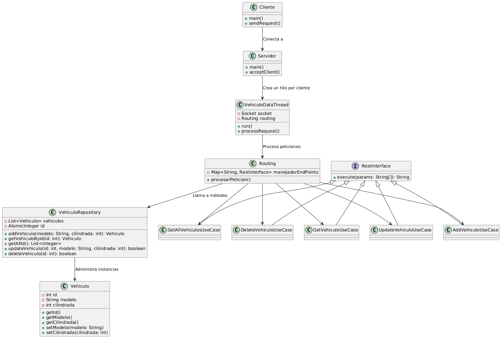
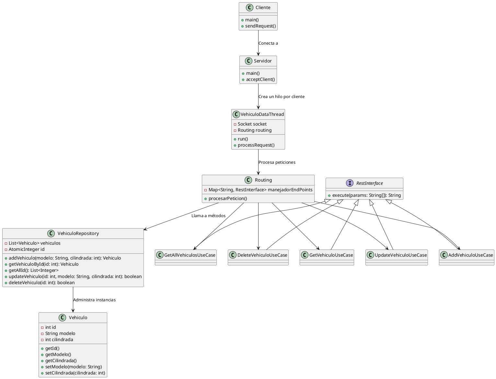

# Proyecto Coches

Aplicación sencilla sobre la conexión entre un Servidor, y varios Clientes por terminal, usando el protocolo TCP y Sockets para la conexión.

Para lanzar el Servidor, abriremos una terminal y nos iremos hasta la ruta de la carpeta raíz del proyecto, y ejecutaremos el siguiente comando:

```
    java -cp bin server.main.Servidor
```

Una vez iniciado el Servidor, desde una nueva terminal, nos iremos a la misma ruta, la raíz del proyecto, y ejecutaremos el siguinte comando para iniciar un Cliente:

```
    java -cp bin client.Cliente
```
Repetiremos el proceso del Cliente, tantas veces como clientes queramos conectar al servidor.

## Comandos/EndPoints


| Método | Comando | Descripción |
|----------|----------|----------|
| GET   | get id   | El servidor devuelve el vehículo con el ID indicado|
| GETAll   | getAll  | El servidor devuelve todos los IDs de los vehículos que tiene guardados |
| POST   | post modelo cilindrada   | Añade un nuevo vehículo |
| PUT   | put id modelo cilindrada  | Edita el vehículo con el ID indicado con los atributos nuevos |
| DELETE   | delete id   | Elimina el vehículo con el ID indicado |

### Atributos clase Vehículo
```java
    int id;
    String modelo;
    int cilindrada;
```


### Diagrama UML (Diagrama de Clases)

#### Imágen del Diagrama


#### Código de PlantUML


